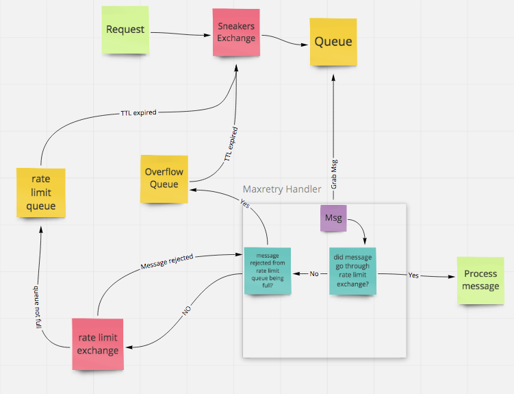

# Rate Limiter Handler

This handler is a rabbitMQ only solution for rate limiting. It can decorate other handlers (ie: OneShot or MaxRetry) 
to allow rate limiting as well as error handling. 

Look at the [rate_limter_handler](/examples/rate_limiter_handler.rb) example to see an example. 

The `rate limit` is calculated as `number of messages / time in seconds`. 

### Options

* rate_limiter_decorated_handler_func - factory used to create the handler that rate limiter will decorate 
* exchange - the name of the exchange that will handle messages as they first come in. (default: 'sneakers')
* overflow_timeout - how long messages will hang out in the overflow queue
* rate_limit_timeout - time portion from the `rate limit`
* rate_limit_length - number of messages portion from the `rate limit`

### Explanation

The rate limit that is achieved by utilizing both a size limit (`rate_limit_length`) and a 
TTL (`rate_limit_timeout`) on rabbitMQ queues.

1. A message enters the queue via the sneakers exchange.
1. A worker will pick up the message
1. If the message came through the rate limit exchange, then process the message. 
Otherwise, try to put the message through the rate limit exchange.
1. If the message does not fit in the rate limit queue, send the message to the overflow queue 
instead.  

### Overflow queue
The overflow queue is in place so that messages do not keep running back and forth when the rate limit queue is full.
Its main purpose is to reduce network traffic.

### Known Issues
1. Every message must go through the rate limit queue to be processed. Because of this, it is advised that the time portion of the
rate limit be as low as possible.
1. If a message is rejected and goes through a MaxRetry handler, that message will be immediately processed when 
retried. This is because headers are preserved when a message is rejected. 
